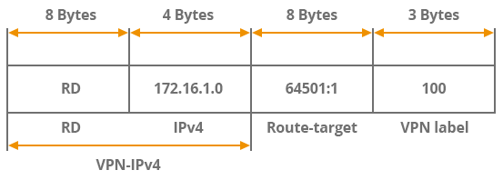
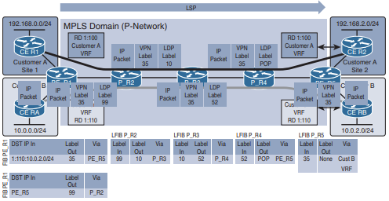

<br>

##### Как конфигурить
1. Создаём пользаковский vrf:  
```
PE1(config)# ip vrf Customer1
PE1(config-vrf)# rd 1:100
PE1(config-vrf)# route-target both 1:100
PE1(config-vrf)# ip vrf Customer2
PE1(config-vrf)# rd 1:110
PE1(config-vrf)# route-target both 1:110
```
Пример, конечно, корявый. Вместо `1` нужно использовать ASN провайдера

2. Поднимаем стык с клиентом и присоединяем его к vrf:  
```
PE1(config)# interface f0/1
PE1(config-if)# ip vrf forwarding Customer1
PE1(config-if)# ip address 10.0.0.1 255.255.255.252
PE1(config-if)# interface f0/2
PE1(config-if)# ip vrf forwarding Customer2
PE1(config-if)# ip address 10.0.0.5 255.255.255.252
```


3. Настраиваем динамическую маршрутизацию с клиентом или прописываем статику до его локальных подсетей  
4. Поднимаем MP-BGP-пир между PE для обмена vpnv4-маршрутами:  
```
PE1(config)# router bgp 64501
PE1(config-router)# neighbor 10.1.1.5 remote-as 64501
PE1(config-router)# neighbor 10.1.1.5 update-source loopback 0
PE1(config-router)# address-family vpnv4
PE1(config-router-af)# neighbor 10.1.1.5 activate
```

<br>

##### Что происходит
1. Для каждого **vrf** ведется своя таблица маршрутизации
2. Для различения маршрутов разных vrf при передаче их через MP-BGP используется 64-битный **route distinguisher(RD)**. Он добавляется к анонсируемому 32-битному префиксу, образуя **VPNv4-маршрут**

Формат MP-BGP **update-сообщения**:  

3. Непосредственно при передаче пакета между площадками клиента принимающий PE вешает на пакет внутреннюю mpls-метку, **VPN метка** - с ней работают только **PE**, и внешнюю, **LSP метка** - с ней будут взаимодейтсвовать все mpls-устройства в процессе передачи пакета через mpls-домен.

