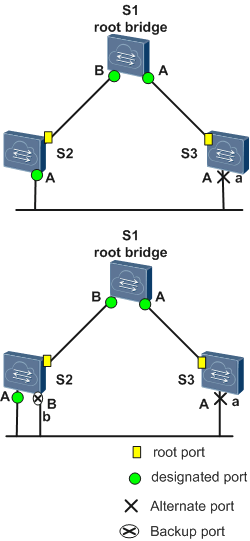
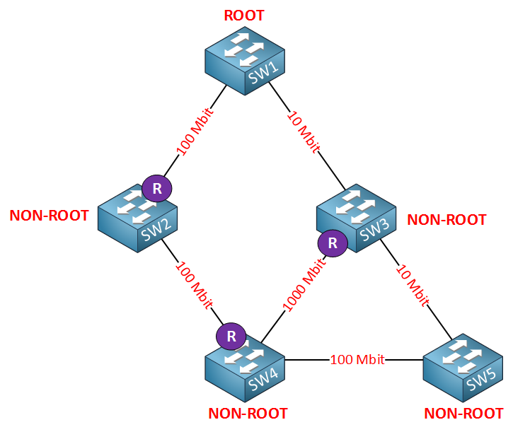

Топология строится относительно root bridge  
Root-ом выбирается свич с наименьшим bridge priority  
Если есть свичи с одинаковым bridge priority, то рут выбирается по наименьшему маку  
 
Роли портов (RSTP):  
| Role          | Описание                                                                          |
|---------------|-----------------------------------------------------------------------------------|
| Root          | Порт через который лежит кратчайший путь до рута                                  |
| Designated    | Не-рут порты. Трафик пропускается                                                 |
| Alternate     | Запасной root-порт. При падении рута, сам становится рутом. Трафик не пропускает  |
| Blocked       | Запасной designated-порт. Все аналогично alternate-порту                          |

 
Порядок выбора root-порта:
1. Наименьшая стоимость пути до рут-бриджа
2. Lowest sender bridge ID
3. Lowest sender port ID

Стоимость пути расчитывается по сумме стоимости линков на пути до рут-свича.  
Чем ниже скорость порта, тем выше стоимость линка  
Стоимость линков по-умолчанию (для RSTP/MSTP):  

| Скорость      | Стоимость |
|---------------|-----------|
| 4 Mbit/s      | 5000000   |
| 10 Mbit/s     | 2000000   |
| 16 Mbit/s     | 1250000   |
| 100 Mbit/s    | 200000    |
| 1 Gbit/s      | 20000     |
| 2 Gbit/s      | 10000     |
| 10 Gbit/s     | 2000      |
| 100 Gbit/s    | 200       |
| 1 Tbit/s      | 20        |

