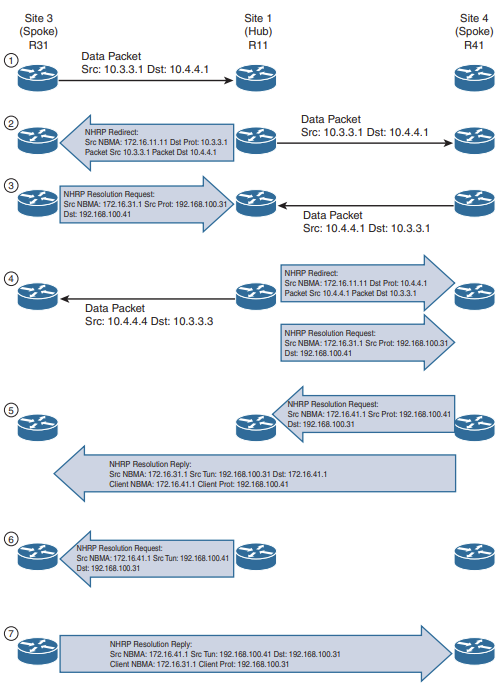

Фазы:  
1. Установление статических *hub-spoke* тунелей
2. Установление динамических *spoke-to-spoke* тунелей (**mGRE**)
3. Направление трафика по *spoke-to-spoke* тунелю (**NHRP** (Next Hop Resolution Protocol))
<br>

##### Hub configuration
```
int tun <номер_тонеля>
  tun so <ip-адрес_или_интерфейс>
  tun mode gre multi              # включаем **mGRE**
  ip add <ip-адрес маска>
  ip nhrp network-id <id>         # присоединяем интерфейс к **NHRP-домену**. ID имеет локальное значение, но   рекомендуется использовать общий id на всех устройствах NHRP-домена
  tunnel key <число>              # *(опционально)* позволяет различать несколько тунельных интерфейсов с   одинаковым tunnel source. Для успешного поднятия тунеля значение с обеих сторон должно совпадать
  ip nhrp map multicast dyn       # включение поддержки NHRP для **мультикаст** трафика
  ip nhrp redir                   # включает **phase 3** 
  band <скорость_в_kbit/s>
  ip mtu <значение_MTU>           # обычно для DMVPN выставляется равным **1400**
  ip tcp adjust-mss <размер_MSS>  # **MSS (Maximum Segment Size)** - это MTU за вычетом IP и TCP заголовков. Для   DMVPN как правило устанвливается равным **1360**, чтобы вместить IP, GRE и IPsec заголовки
```
<br>

##### Spoke Phase 1 configuration
```
int tun <номер_тонеля>
  tun so <ip-адрес_или_интерфейс>
  tun dest <ip-адрес>                                     # указываем underlay-IP хаба
  ip add <ip-адрес маска>
  ip nhrp network-id <id>
  tunnel key <число>
  ip nhrp nhs <overlay-IP> nbma <underlay-IP> [multicast] # этой командой указываем данные хаба (NHRP-сервера),   его тунельный(overlay) и внешний(underlay) IP. Команда *multicast* включает поддержку мультикаст-трафика
  band <скорость_в_kbit/s>
  ip mtu 1400
  ip tcp adjust-mss 1360
```
<br>

##### Spoke Phase 2 configuration
```
tun mode gre multi  # используем вместо *tun dest*
```
<br>

##### Phase 3 configuration
Хаб:  
```
ip nhrp redirect
```
Spoke:
```
ip nhrp shortcut
```
