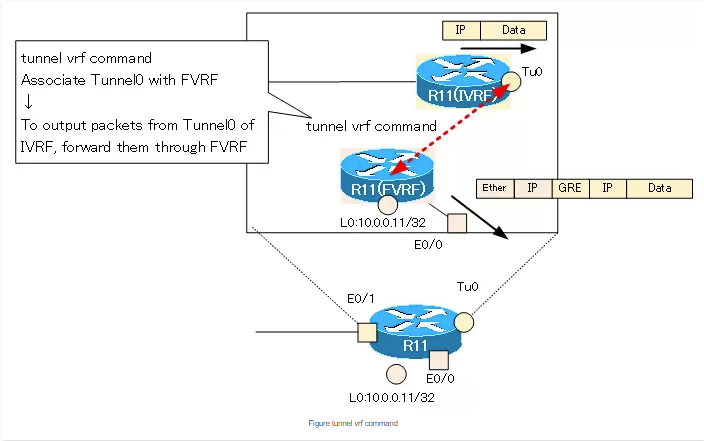

При реализации **DMVPN** существуют две потенциальные проблемы:
1. Рекурсивная маршрутизация.  
Возникает если *underlay*-сеть анонсировать в процесс маршрутизации запущенный в *overlay*-сети
2. Проблема выбора исходящего интерфейса для инкапсуляции:  
Возникает в случае если underlay-IP GRE-соседа доступен через несколько маршрутов с одинаковой метрикой.  
Например, при наличии подключения к двум ISP, таблица может содержать два дэфолтных маршрута - к каждому ISP свой.  

Одним из возможных решений является применение **Front Door VRF (FVRF)**.  
Суть приёма - распределить WAN-интерфейсы и тунель по соответствующим *vrf*.  
```
# Объявляем vrf-ы
vrf def INET1
  address-fam ipv4
vrf def INET2
  address-fam ipv4

# Назначаем vrf-ы интерфейсам
# При присоединении интерфейса к vrf, настройка ip-адреса будет удалена, необходимо ввести заново
int gi0/1
  vrf for INET1
  ip add <ip mask|dhcp>
int gi0/2
  vrf for INET2
  ip add <ip mask|dhcp>
int tun 1
  tun vrf INET1 # сам тунель будет находится в глобальной таблице маршрутизации, но сможет пользоваться таблицей маршрутизации *INET1* для *tunnel so* и *tunnel dest*
```
 