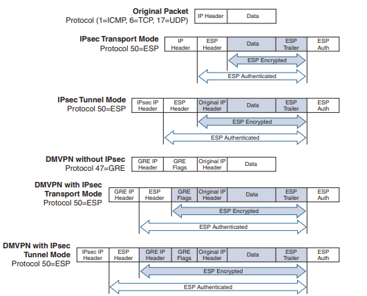
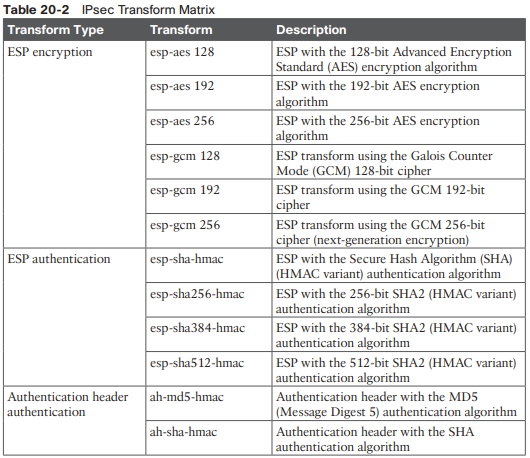

**IPsec** состоит из трех компонентов:  
  * **Security protocols** - способ защиты информации:
    * **Authentication Header** - создаёт сигнатуру, использующуюся для контроль подлинности защищаемых данных, защита от подмены данных
    * **ESP** - защита данных методом шифрования с последующей инкапсуляцией:
      * **transport mode** - шифруется только payload
      * **tunnel mode** - шифруется весь ip-пакет вместе с L3-заголовками
  * **Key Management** - компонент управления ключами шифрования:
    * по-умолчанию IPsec использует протокол **IKE/IKEv2**
  * **Security Associations** (SAs) - описание согласованных параметров защищаемого соединения:
    * **IKE SA** *(control plane)* - параметры согласованные для key management и менеджмента IPsec SAs
    * **IPsec SA** *(data plane)* - параметры согласованные непосредственно для защиты данных
<br>


<br>

##### Настройка
###### IKEv2 keyring
```
crypto ikev2 keyring <имя_репозитория>  # Создаём репозиторий PSKs
    peer <name>                         # Имя пира
    add <network> <mask>                # Задаём диапазон адресов, к которым применяется репозиторий, 0.0.0.0 0.0.0.0 - любой IP
    pre-shared-key <пароль>             # Задаём сам пароль
```
<br>

###### IKEv2 Profile
```
crypto ikev2 profile <имя_профиля>              # Создаём профиль - набор заданных, не требующих согласования параметров, используемых в процессе IKE security association (SA)
    match ident rem add <ip_address>            # Задаём ip пира. 0.0.0.0 - любой пир
    match fvrf <имя_vrf>                        # Указываем если тунели работают с использованием FVRF, *any* - для применения к любому **FVRF**
    auth local [pre-share|rsa-sig]              # Задаём режим аутентификации для принимаемых от пира запросов
    auth rem [pre-share|rsa-sig]                # Задаём режим аутентификации для отправляемых пиру запросов
    keyring local <имя_репозитория>             # Связываем профиль с keyring_репозиторием
```
<br>

###### IPsec Transform Set
*Transform set* задаёт параметры шифрования и аутентификации трафика  
```
crypto ipsec transform-set <name> <esp_encrypt> <esp_auth> <ah_auth>
    mode [transport|tunnel]
```

<br>

###### IPsec Profile
Связывает *IPsec transform set* и *IKEv2*-профиль  
```
crypto ipsec profile <name>
    set transform-set <name>
    set ikev2-profile <name>
```
Применяем профиль к тунелю
```
int tun <номер_тунеля>
    tun prot ipsec prof <имя_ipsec_профиля> [shared]    # команда *shared* нужна в случаях, когда существует несколько тунелей на одном *underlay*-интерфейсе
```