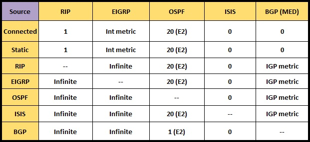

##### Таблица значений AD по-умолчанию для различных протоколов маршрутизации
| Protocol  | AD    |
|-----------|-------|
| connected | 0     |
| static    | 1     |
| eBGP      | 20    |
| OSPF      | 110   |
| iBGP      | 200   |
 

##### Таблица редистрибьюции протоколов
