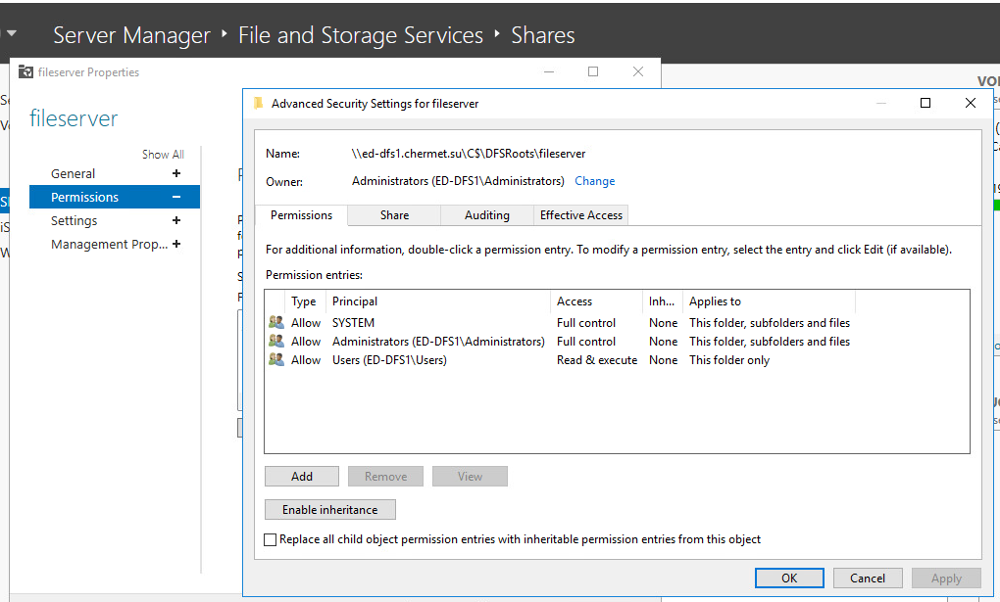
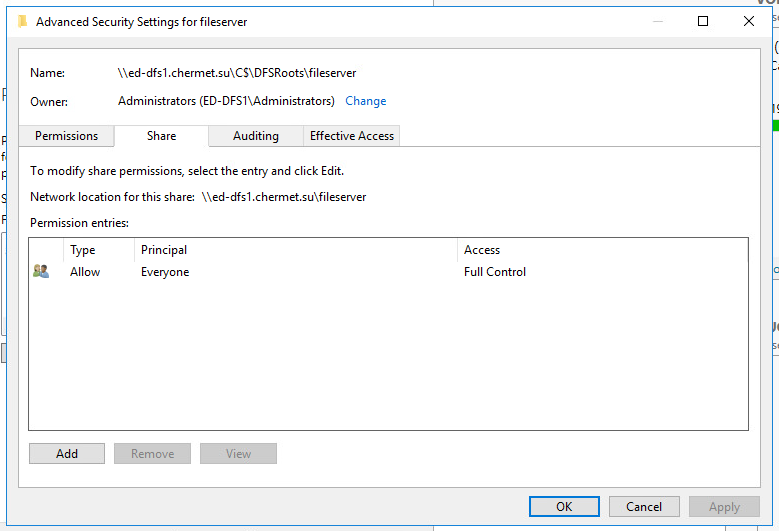
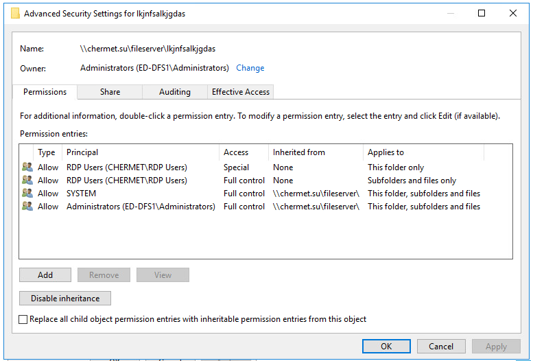

#### File permissions
Есть два вида прав: *NTFS* и *shared*  
<br>

##### Локальные
Локально действуют только разрешения NTFS (вкладка *Security*).  
Если пользователь входит в несколько *security group* с различными правами, то действуют права с наибольшими привилегиями  
<br>

##### Удаленные
При удаленном доступе действуют и права NTFS, и shared права. Приоритет имеют меньшие привелегии
<br>

##### Example

В этом примере пользователь локально получит правила с наибольшим приоритетом из подходящих в *NTFS* - **FC**,  
а удаленно - наименьшие из подходящих в *shared* и *NTFS* - **R**
<br>

##### Best practice
1. На папку *namespace* задаем следующие права:
  

*NOTE:*  
* Наследование выключено
* Группа *Users* (это и доменные и локальные пользователи) получают права, только для данной папки. Пользователи должны иметь доступ на сам *namespace*, но не иметь возможности создавать папки в корне - это делают админы
2. **Shared** права даём всем **FC**:  

3. В корне создаем папку с нужными правами (например, на отдел)  
  
  
Здесь нужной пользовательской группе задаем специальные права на саму папку и **FC** на все файлы и подпапки.  
Специальные права включают в себя **RX** плюс права на **создание файлов и папок**
Таким образом пользователи видят папку своего отдела, но не могут ее например удалить. При этом они могут свободно создавать и манипулировать файлами и подпапками
<br>

#### Теневое копирование (VSS)
##### Usefull commands:
```
vssadmin add shadowstorage /for=C: /on=D: /maxsize=200MB    # создаём хранилище теневых копий
vssadmin list shadowstorage         # смотрим список созданных хранилищ
vssadmin create shadow /for=C:     # создаём теневую копию раздела
vssadmin list shadows               # список существующих теневых копий

# Менеджмент команды
vssadmin delete shadows /for=C: /all        # Удаление всех теневых копий для определённого тома
vssadmin delete shadows /for=C: /oldest     # Удаление самой старой теневой копии
vssadmin delete shadows /shadow={ID теневой копии}      # Удаление теневой копии по её ID
vssadmin delete shadowstorage /for=ForVolumeSpec [/on=OnVolumeSpec]     # Удаляет ассоциацию хранения теневых копий
```